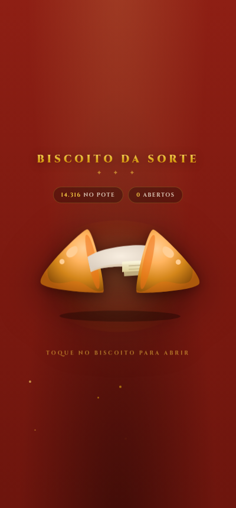
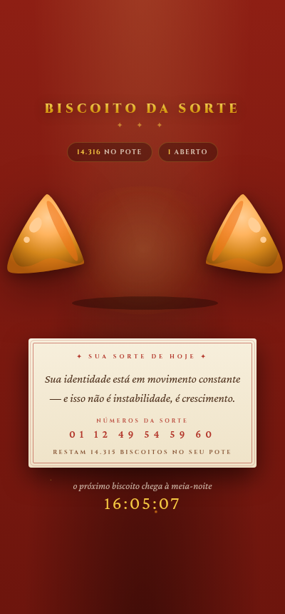

# 🥠 Biscoito da Sorte

**Cada dia da sua vida é um biscoito. Abra o de hoje — ele não volta amanhã.**

[Abrir o de hoje](https://rafa.pro.br/biscoito/)

---

| Antes de abrir | A sorte do dia |
|:---:|:---:|
|  |  |

## Como funciona

Você informa mês e ano de nascimento; pela expectativa de vida do IBGE, o app conta quantos dias — quantos **biscoitos** — ainda há no seu pote. Todo dia à meia-noite chega um novo. Quebre-o e leia o papelzinho: uma frase (de um banco de 600, em quatro tons conforme o tamanho do seu pote) e seis números da sorte.

Biscoito não aberto no dia é **perdido para sempre**. O app conta, sem drama: é só um lembrete gentil de que os dias também são assim.

## Detalhes de implementação

- **Sorte determinística**: frase e números vêm de um hash de (dia + nascimento) — recarregar a página não muda o destino
- **Novo biscoito à meia-noite** (não "24h após abrir"): countdown e virada de estado sincronizados
- **PWA offline** — service worker cache-first, instala na tela inicial
- HTML/CSS/JS puro, sem framework, sem build

## Créditos

- Ícone: [Fluent Emoji](https://github.com/microsoft/fluentui-emoji) © Microsoft (MIT)
- Expectativa de vida: Tábuas de Mortalidade IBGE
- Feito com 🧡 por [rfmss](https://github.com/rfmss)
